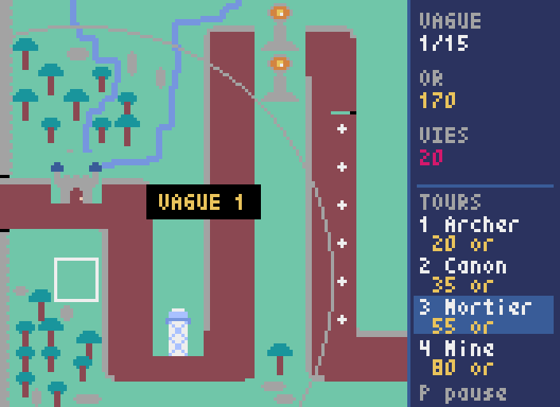
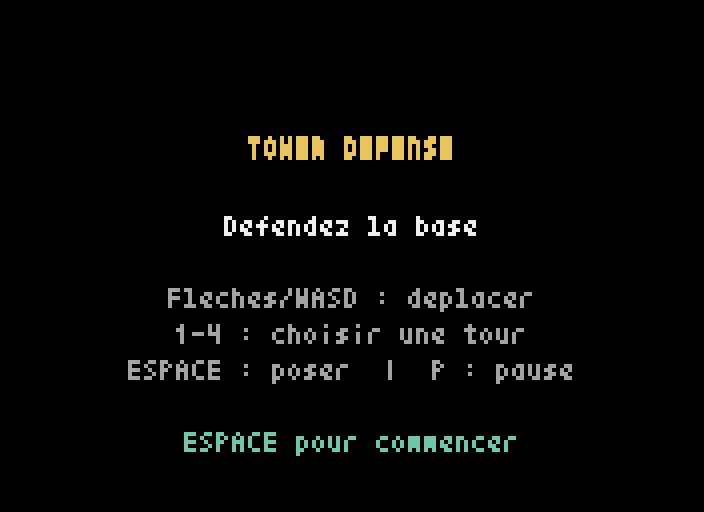

<div align="center">

# 🏰 Tower Defense

**Un jeu de défense de tours rétro, en pixel art, développé en Python avec [Pyxel](https://github.com/kitao/pyxel).**

Placez vos tours, survivez à 15 vagues d'ennemis et protégez votre base.

[](https://www.python.org/)
[](https://github.com/kitao/pyxel)
[](LICENSE)



</div>

---

## ✨ Fonctionnalités

- 🗺️ **Carte en pixel art** avec un chemin sinueux à défendre
- 🏹 **4 types de tours** aux comportements distincts (portée, cadence, dégâts, mine de contact)
- 🌊 **15 vagues** de difficulté croissante avec des ennemis de plus en plus coriaces
- ❤️ **Système de vies** : chaque ennemi qui atteint la base coûte une vie — défaite à 0
- 🏆 **Condition de victoire** : survivez à la dernière vague
- 💰 **Économie** : gagnez de l'or en éliminant les ennemis, dépensez-le en tours
- 🎯 **Interface soignée** : panneau HUD dédié, aperçu de portée, indicateur de placement valide/invalide, barres de vie
- 🔊 **Effets sonores** générés par code
- ⏸️ **Menu, pause, écrans de défaite et de victoire**

## 🎮 Aperçu

| Menu | En jeu |
|:---:|:---:|
|  |  |

## 🚀 Installation & lancement

Il vous faut **Python 3.8+**.

```bash
# 1. Cloner le dépôt
git clone https://github.com/VOTRE-UTILISATEUR/tower-defense.git
cd tower-defense

# 2. Créer un environnement virtuel (recommandé)
python -m venv .venv
source .venv/bin/activate        # Windows : .venv\Scripts\activate

# 3. Installer les dépendances
pip install -r requirements.txt

# 4. Jouer !
python app.py
```

> 💡 Vous pouvez aussi lancer le jeu avec `python -m tower_defense`.

## ⌨️ Commandes

| Touche | Action |
|:---|:---|
| **Flèches** ou **WASD** | Déplacer le curseur |
| **1 · 2 · 3 · 4** | Sélectionner un type de tour |
| **Espace** / **Entrée** | Poser la tour sélectionnée · valider |
| **P** | Pause |
| **R** | Rejouer (après une défaite ou une victoire) |
| **Q** | Quitter |

## 🏹 Les tours

| # | Tour | Coût | Dégâts | Portée | Particularité |
|:---:|:---|:---:|:---:|:---:|:---|
| 1 | **Archer** | 20 | 1 | 56 | Bon marché, cadence élevée |
| 2 | **Canon** | 35 | 2 | 64 | Équilibrée |
| 3 | **Mortier** | 55 | 4 | 80 | Longue portée, gros dégâts |
| 4 | **Mine** | 80 | ∞ | contact | Détruit tout ennemi au contact, peut se poser sur le chemin |

## 🧠 Comment jouer

1. Au démarrage, appuyez sur **Espace** pour lancer la partie.
2. Déplacez le curseur et choisissez une tour avec les touches **1 à 4**.
3. Le contour du curseur devient **vert** si le placement est valide, **rouge** sinon (pas assez d'or, sur le chemin ou sur une autre tour). Un cercle indique la **portée**.
4. Posez la tour avec **Espace**. Éliminez les ennemis pour gagner de l'or et financer votre défense.
5. Ne laissez pas les ennemis atteindre la base : chaque fuite coûte une vie. Tenez **15 vagues** pour gagner !

## 🗂️ Architecture du projet

```
tower-defense/
├── app.py                    # Point d'entrée (python app.py)
├── assets/
│   └── theme.pyxres          # Ressources Pyxel (carte, sprites, palette)
├── tower_defense/            # Package du jeu
│   ├── __init__.py
│   ├── __main__.py           # python -m tower_defense
│   ├── settings.py           # Constantes & équilibrage
│   ├── audio.py              # Effets sonores
│   ├── entities.py           # Curseur, Tour, Ennemi, Projectile, Explosion
│   └── game.py               # Boucle de jeu, machine à états, HUD
├── docs/                     # Captures d'écran
├── requirements.txt
├── pyproject.toml
└── LICENSE
```

Le code sépare clairement **la configuration** (`settings.py`), **les entités** (`entities.py`)
et **l'orchestration** (`game.py`, une machine à états : menu → jeu → pause → défaite/victoire).
Tout l'équilibrage du jeu se règle depuis `settings.py`.

## 🛠️ Technologies

- [**Python**](https://www.python.org/)
- [**Pyxel**](https://github.com/kitao/pyxel) — moteur de jeu rétro « fantasy console »

## 📜 Histoire du projet

Ce jeu est né lors d'une **Nuit du Code**, puis a été retravaillé pour offrir un rendu
plus abouti : interface dédiée, système de vies et de victoire, sons, effets visuels et
une base de code modulaire.

## 📄 Licence

Distribué sous licence **MIT**. Voir le fichier [LICENSE](LICENSE).
