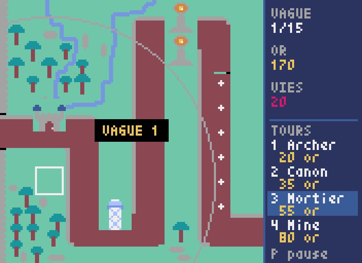

# Tower Defense

Un jeu de défense de tours en pixel art, écrit en Python avec
[Pyxel](https://github.com/kitao/pyxel). Posez vos tours le long du chemin et
tenez 15 vagues.



Né pendant une Nuit du Code, puis repris pour ajouter le HUD, le système de
vies, la condition de victoire et les sons.

## Les tours

| # | Tour | Coût | Dégâts | Portée | Particularité |
|:---:|:---|:---:|:---:|:---:|:---|
| 1 | Archer | 20 | 1 | 56 | Bon marché, cadence élevée |
| 2 | Canon | 35 | 2 | 64 | Équilibrée |
| 3 | Mortier | 55 | 4 | 80 | Longue portée, gros dégâts |
| 4 | Mine | 80 | ∞ | contact | Détruit tout au contact, se pose sur le chemin |

Chaque ennemi qui atteint la base coûte une vie. Éliminer un ennemi rapporte de
l'or, qui sert à financer les tours suivantes.

## Commandes

Flèches ou WASD pour déplacer le curseur, `1` à `4` pour choisir une tour,
Espace pour la poser. Le contour du curseur passe au vert si le placement est
valide, au rouge sinon, et un cercle montre la portée.

`P` pause, `R` rejoue, `Q` quitte.

## Jouer

Les exécutables Windows et macOS sont dans les
[Releases](https://github.com/antoninche/tower-defense/releases) — aucune
installation de Python nécessaire. Sur macOS, clic droit sur l'app puis
*Ouvrir* au premier lancement : elle n'est pas signée.

Depuis les sources (Python 3.8+) :

```bash
pip install -r requirements.txt
python app.py
```

## Organisation du code

Tout l'équilibrage du jeu (coûts, portées, dégâts, composition des vagues) est
dans `settings.py`, ce qui permet de le régler sans toucher au reste.
`entities.py` contient le curseur, les tours, les ennemis et les projectiles ;
`game.py` la boucle principale et la machine à états menu → jeu → pause →
défaite/victoire.

Les effets sonores sont générés par code plutôt que chargés depuis des fichiers.
